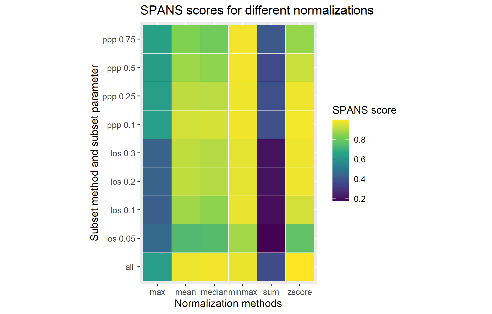
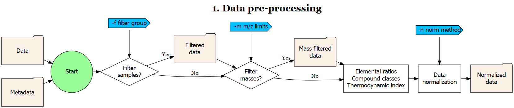
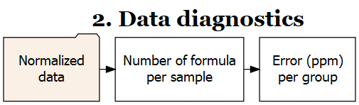
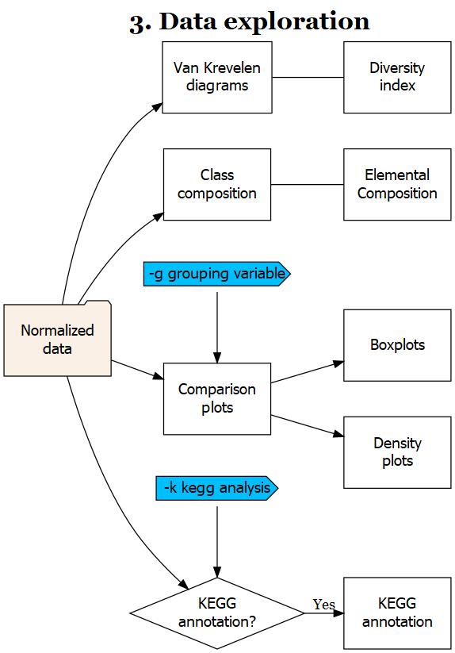
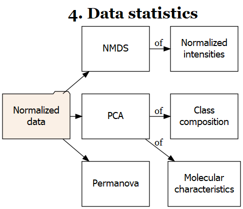
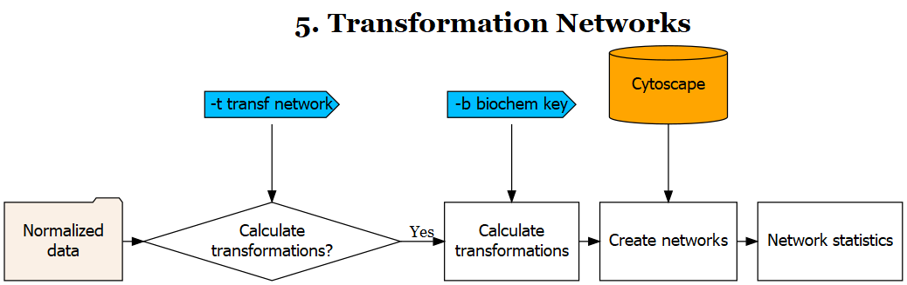

# User Guide for MetaboDirect

## Introduction

**MetaboDirect** is a Python and R based pipeline for the analysis of Direct Injection FT-ICR Mass Spectrometry data.
The MetaboDirect pipeline takes a Formularity (Tolić et al., 2017) *report* and a *sample information* file as inputs and automatically performs all the analysis described below including: sample filtering, m/z filtering, normalization of intensities, thermodynamic index calculation, annotation of molecular formulas using the KEGG database (Kanehisa & Goto, 2000), statistical analysis and construction of transformation networks using Cytoscape (Shannon et al., 2003)

## Quick Start

To quickly run the MetaboDirect pipeline use the following command. Read below for a more detailed information about the *input data* and the analysis options that are offered.

```
/path/to/MetaboDirect/run_metabodirect.py DATA_FILE METADATA_FILE -g GROUPING_VARIABLE
```
Information about the arguments can be obtained using the -h/--help function.

```
/path/to/MetaboDirect/run_metabodirect.py -h
```

```
usage: run_metabodirect.py [-h] [-o OUTDIR] [-m INT INT] -g STR [STR ...] [-f STR STR] [-b STR] [-t] [-k] [-n STR] [--norm_subset STR] [--subset_parameter STR] [--log_transform]
                           DATA METADATA

Program for running all the MetaboDirect analysis pipeline

positional arguments:
  DATA                  Name of the file with the DI-MS data in .csv format
  METADATA              Name of the file with the sample information (metadata) in .csv format

optional arguments:
  -h, --help            show this help message and exit
  -o OUTDIR, --outdir OUTDIR
                        Output directory (default: MetaboDirect_output)
  -m INT INT, --mass_filter INT INT
                        Range to filter m/z data (min_mz, max_mz). The pipeline will not filter m/z values by default (default: None)
  -g STR [STR ...], --group STR [STR ...]
                        Grouping variables for coloring and faceting figures (Max 2) (default: None)
  -f STR STR, --filter_by STR STR
                        Filter samples based on metadata. First enter the name of the feature,followed by the values associated with the samples you want to keep in the
                        analysis.(Example -f Habitat Bog,Palsa) (default: None)
  -b STR, --biochem_key STR
                        File with the biochemical key to use for the transformation network (default: Default key)
  -t, --transformation_analysis
                        Set this option to perform a transformation netwokr analysis of the samples (default: False)
  -k, --kegg_annotation
                        Set this option to perform annotation of the molecular formulas usingthe KEGG database (default: False)

Normalization methods:
  Options to define how data normalization will be carried out

  -n STR, --norm_method STR
                        Available methods to normalize data (default: max)
  --norm_subset STR     Subset of the data to use for normalization purpouses. LOS uses peaks in the top L order statistics, PPP uses peaks having a minimum percentage of observed
                        values. (default: ALL)
  --subset_parameter STR
                        If using a sample subset for nomalization, this parameter defines the subsample of peaks that will be used for normalization.If not defined, the default values
                        will be 0.3 for LOS and 0.5 for PPP (default: None)
  --log_transform       Set this option to log transform the data. (Program will fail if there are peaks with intensities of 0. Consider tranforming this values into 1 if log
                        transformation is desired (default: False)
```

## MetaboDirect arguments

**MetaboDirect** requires two files, a report from Formularity (data file) and a sample information file (metadata file), and at least one grouping variable (defined in the metadata file).

#### Input data file

The input data for **MetaboDirect** is the a .csv report generated by default by Formularity. If Formularity was not used, the data file should be arranged to have columns with the **exact same names** that are shown below. 
*Mass1, Mass2, ...* refer to the m/z values detected by the software (i.e. each peak) while *Sample1, Sample2, ..* refer to the intesity of each peak for each of the samples.
An example dataset is included in the `/path/to/MetaboDirect/data/` directory with the name `Report.csv`.

|Mass|C|H|O|N|C13|S|P|Na|El_comp|Class|NeutralMass|Error_ppm|Candidates|*Sample1*|*Sample2*|*Sample3*|*...*|
|---|---|---|---|---|---|---|---|---|---|---|---|---|---|---|---|---|---|
|*Mass1*|4|4|4|4|0|0|0|0||NA|111.634719|0|NA|6.237|0|0|
|*Mass2*|5|2|2|0|0|0|0|0||NA|111.712035|0|NA|0|6.343|6.166|
|*Mass3*|3|6|2|2|0|1|0|0||NA|112.125136|0|NA|7.549|7.363|6.75|
|*Mass4*|5|6|3|0|0|0|1|0||NA|112.3957945|0|NA|0|0|6.145|
|*Mass5*|6|2|3|0|0|0|1|0||NA|112.457043|0|NA|0|6.133|0|
|*...*|||||||||||||||||

#### Sample information file

The sample information file (or metadata file) is a .csv file that has one column called *SampleID* with the names of all of the samples that are present in the report file. Please make sure that the sample names in the *input data* and the *sample information file* are **exactly the same**. At least one other column must be present in the sample information file and must contain information used to group the data for plotting and for the statistical analysis. Multiple grouping variables can be present in this file but only two can be used simultaneously in **MetaboDirect**. When running the pipelines the grouping variables can be defined with the `-g` option using the **exact name** that it is on this file.  Additionally, please use only letters (Aa-Zz), numbers (0-9) and underscores (\_) for both the **sample names** and the **grouping variables**.
An example file is included in the `/path/to/MetaboDirect/data/` directory with the name `metadata.csv`.

|SampleID|Grouping_var1|Grouping_var2|Grouping_var3
|---|---|---|---|
|*Sample1*|A|M|X|
|*Sample2*|A|N|Y|
|*Sample3*|B|M|Y|
|*Sample4*|B|N|X|
|*Sample5*|A|N|Z|

#### Output directory (-o/--outdir)

The name of directory where all the generated plots, tables and scripts will be saved. If it is not defined the directory will be names MetaboDirect_output by default

#### Grouping variable (-g/--group)

This option accepts up to two grouping variables (e.g. `-g Grouping_var1` or `-g Grouping_var1 Grouping_var2`) whose names are **exactly the same** as they appear in the columns of the metadafile. The first grouping variable will be used for giving colors to the plots generated. Both variables will be used for the statistical analysis and the pairwise comparisons.

#### Filter samples (-f/--filter_by)

This option takes two arguments: (a) a variable from the metadata file and (b) values from that variable column that we want to keep in the analysis. For example `-f Grouping_var3 X`, will keep just the samples for whom the Groupin_var3 is equal to "X". Multiple values for the same variable can be defined separated by commas (without spaces) (i.e. `-g Grouping_var3 X,Z`).

#### Mass filter (-m/--mass_filter)

This option takes two arguments: lower and an upper m/z limits. Peaks with m/z (masses) outside of its limits will be filtered out and not considered in the analysis.

#### Normalization method (-n/--norm_method)

This option defines which normalization method will be used to normalize the intensities (*I*). It can take one of the following options for *i* samples and *j* peaks.
Normalization methods are based on the ones used by Kitson, et al. (2021) and Thompson, et al. (2021)

|Normalization method|Formula|
|---|---|
|`max`||
|`minmax`||
|`mean`||
|`median`||
|`sum`||
|`zscore`||
|`binary`|Transform data into presence (1) absence (0)|
|`none`|Do not perform any normalization|

#### Normalization subset method (--norm_subset) and subset parameter (--subset_parameter)

If a normalization method other than `binary` or `none` is selected it is possible to use only a fraction of the peaks to calculate the normalization factors (normalization will still be applied to all the dataset). Possible subset methods are :

|Subset method|Description|
|---|---|
|`ALL`|Use all present peaks to calculate normalization factors|
|`LOS`|Use a percentage of peaks in the top L order statistics|
|`PPP`|Uses peaks that are present in more than minimum percentage of samples|

The option `--subset_parameter` defines the percentage of peaks that will be used in `LOS` or the minimum percentage of samples that a peak must be present for `PPP`.

#### KEGG annotation (-k/--kegg_annotation)

This is an optional step as it may take a long time (~ couple of hours) depending on the number of peaks present in the data. If this option is present, the assigned molecular formulas will be searched against the KEGG database to produce a table with their KEGG name, KEGG pathway, etc.

#### Transformation networks (-t/--transformation_analysis)

This option define whether or not a transformation network of the samples based on mass differences will be carried out. This step requires CYtoscape (version 3.8 and above) to be installed in the machine. **MetaboDirect** will ask the user to open Cytoscape when required in order to construct the networks. When prompted in the screen, please open Cytoscape and then hit enter to continue wiht the analysis.

#### Biochemical transformation key (-b/--biochem_key)

**MetaboDirect** comes with a biochemical transformation key that defines many of the most common transformations that happen in soil samples. This option can be used to enter a new biochemical key with transformations more closely related to the user's data. The default transformation key can be found in `/path/to/MetaboDirect/data/transf_key.csv`.

## MetaboDirect pipeline

The **MetaboDirect** pipeline includes 5 major steps: data pre-processing, data diagnostics, data exploration, statistical analysis, and transformation network analysis. In addition an optional script `normalization_test.py` can be run before **MetaboDirect** to help the user choose the best normalization method for the data.

### (Optional Step) Test normalization methods

A companion script called `normalization_test.py` is included to help in the decision of which normalization method to use. This script uses a procedure the Statistical Procedure for the Analysis of Normalization Strategies (SPANS) (Webb‐Robertson et al., 2011), which has been previously demonstrated to work well with FT-ICR MS data (Thompson et al., 2021).
Information about the arguments can be obtained using the -h/--help function.

```
/path/to/MetaboDirect/normalization_test.py -h
```
This python script will generate an R script that utilizes a modified `spans_procedure()` function from the `pmartR` package (Stratton et al., 2019; Thompson et al., 2021). 
This script will produce a heatmap as a result with the "SPANS score" of the combination of each of the available normalization methods and data subset methods and subset parameters.

<p align="center"></p>

### 1. Data pre-processing

<p align="center"></p>

DUring this step this step samples will samples will be filtered out based on the `-f` option. Detected peaks will also be filtered out inf the `-m` option was specificied. After filtering elemental ratios will be calculated. Compound classes will be defined based on elemental ratios, the boundaries to determine compound classes can be found (or modified) in the file `/path/to/MetaboDirect/data/compound_class_table.csv`. Thermodynamic indices are calculated based on the assigned molecular formula as follows:

|Index|Formula|
|---|---|
|Nominal Oxidation State of Carbon (NOSC)||
|Gibbs Free Energy (GFE)||
|Double Bond Equivalent (DBE)||

### 2. Data diagnostics

<p align="center"></p>

### 3. Data exploration

<p align="center"></p>

### 4. Statistical Analysis

<p align="center"></p>

### 5. Transformation Networks

<p align="center"></p>

## References

- Kanehisa, M., & Goto, S. (2000). KEGG: Kyoto Encyclopedia of Genes and Genomes. Nucleic Acids Research, 28(1), 27-30. https://doi.org/10.1093/nar/28.1.27 
- Kitson, E., Kew, W., Ding, W., & Bell, N. G. A. (2021). PyKrev: A Python Library for the Analysis of Complex Mixture FT-MS Data. Journal of the American Society for Mass Spectrometry, 32(5), 1263-1267. https://doi.org/10.1021/jasms.1c00064 
- Shannon, P., Markiel, A., Ozier, O., Baliga, N. S., Wang, J. T., Ramage, D., Amin, N., Schwikowski, B., & Ideker, T. (2003). Cytoscape: a software environment for integrated models of biomolecular interaction networks. Genome research, 13(11), 2498-2504. https://doi.org/10.1101/gr.1239303
- Stratton, K. G., Webb-Robertson, B.-J. M., McCue, L. A., Stanfill, B., Claborne, D., Godinez, I., Johansen, T., Thompson, A. M., Burnum-Johnson, K. E., Waters, K. M., & Bramer, L. M. (2019). pmartR: Quality Control and Statistics for Mass Spectrometry-Based Biological Data. Journal of Proteome Research, 18(3), 1418-1425. https://doi.org/10.1021/acs.jproteome.8b00760
- Thompson, A. M., Stratton, K. G., Bramer, L. M., Zavoshy, N. S., & McCue, L. A. (2021). Fourier transform ion cyclotron resonance mass spectrometry (FT-ICR-MS) peak intensity normalization for complex mixture analyses [https://doi.org/10.1002/rcm.9068]. Rapid Communications in Mass Spectrometry, 35(9), e9068. https://doi.org/https://doi.org/10.1002/rcm.9068
- Tolić, N., Liu, Y., Liyu, A., Shen, Y., Tfaily, M. M., Kujawinski, E. B., Longnecker, K., Kuo, L.-J., Robinson, E. W., Paša-Tolić, L., & Hess, N. J. (2017). Formularity: Software for Automated Formula Assignment of Natural and Other Organic Matter from Ultrahigh-Resolution Mass Spectra. Analytical Chemistry, 89(23), 12659-12665. https://doi.org/10.1021/acs.analchem.7b03318
- Webb‐Robertson, B. J. M., Matzke, M. M., Jacobs, J. M., Pounds, J. G., & Waters, K. M. (2011). A statistical selection strategy for normalization procedures in LC‐MS proteomics experiments through dataset‐dependent ranking of normalization scaling factors. Proteomics, 11(24), 4736-4741.


