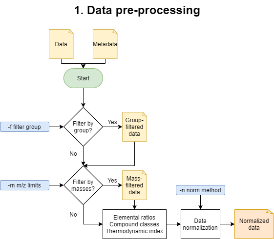
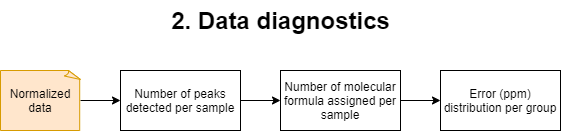
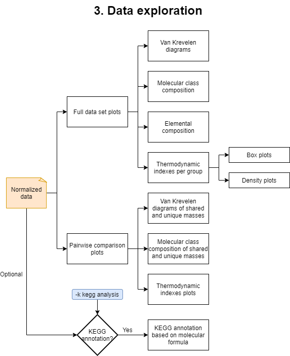
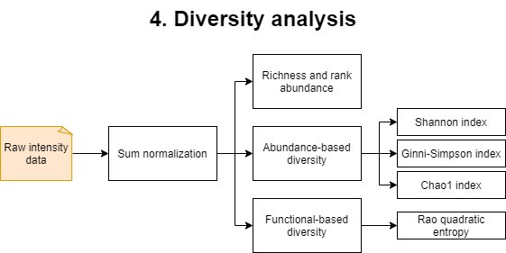
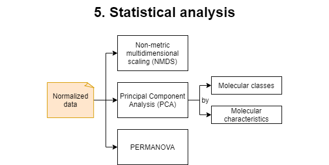
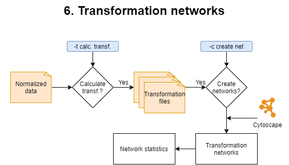

=====================
MetaboDirect pipeline
=====================

The **MetaboDirect** pipeline includes 5 major steps: data pre-processing, data diagnostics, data exploration, statistical analysis, and transformation network analysis, which can be run with the ``metabodirect`` command. For more information check :ref:`metabod` in the User's Guide.

Additionally, the ``test_normalization`` command can be run before the main **MetaboDirect** pipeline, to help deciding which normalization method to use for the analysis.

------------------------------------------
(Optional Step) Test normalization methods
------------------------------------------

The command ``test_normalization`` uses the Statistical Procedure for the Analysis of Normalization Strategies (SPANS) (Webb and Robertson et al., 2011), which has been previously demonstrated to work well with FT-ICR MS data (Thompson et al., 2021). This method systematically evaluates the effect of several normalization methods on the between-group variance structure to identify which method improves the structure of the data while introducing the less amount of bias. The SPANS method has been previously demonstrated to work well with FT-ICR MS data (Thompson et al., 2021). For more information check :ref:`testnorm` in the User's Guide.

----------------------
1. Data pre-processing
----------------------

These is the beginning of the main **MetaboDirect** pipeline. During this step this step samples will samples will be filtered out based on the ``-f`` option. Detected peaks will also be filtered out inf the ``-m`` option was specificied. After filtering elemental ratios will be calculated. Compound classes will be defined based on elemental ratios, the boundaries to determine compound classes can be found in the file: `compound_class_table.csv <https://github.com/Coayala/MetaboDirect/blob/main/metabodirect/data/compound_class_table.csv>`_. Thermodynamic indices are calculated based on the assigned molecular formula as follows:

.. csv-table::
	:header: "Index", "Formula"

	"Nominal Oxidation State of Carbon (NOSC)", |NOSC_eq|
	"Gibbs Free Energy (GFE)", |GFE_eq|
	"Double Bond Equivalent (DBE)", |DBE_eq|
	"Aromatic Index (modified) (AI_mod)", |AI_mod_eq|

.. |NOSC_eq| image:: https://render.githubusercontent.com/render/math?math=NOSC = \frac{4C + H -3N -2O +5P -2S}{C}%2B4
.. |GFE_eq| image:: https://render.githubusercontent.com/render/math?math=GFE=60.3-28.5 * NOSC
.. |DBE_eq| image:: https://render.githubusercontent.com/render/math?math=DBE = 1 %2B 0.5(2C-H %2B N %2B P)
.. |AI_mod_eq| image:: https://render.githubusercontent.com/render/math?math=AI = 1 %2B C - 0.5O - S - \frac{0.5(H %2B P %2B N)}{C - 0.5O - S - N - P}

Data will be normalized during this step to be used in all of the subsequent analysis.

-------------------
2. Data diagnostics
-------------------

In this step plots with the number of detected peaks on each sample and the number of molecular formulas that were assigned per each sample will be generated. In addition the error (in ppm) during the formula assigment will also be plotted based on the grouping variables.

-------------------
3. Data exploration
-------------------

This step will generate and run an R script named **data_exploration.R**. This part of the analysis will generate plots for the elemental and molecular compound class composition, Van Krevelen diagrams of the detected masses, and violin and density plots of the previoulsy mentioned thermodynamic indices. In addition, it will generate directories that contain plots of the pairwise comparisons among the different values in the specified grouping variables.

If the option ``-k`` was selected another R script named **KEGG_annotation.R** will be created. It will produce an additional .csv file with KEGG annotations of the detected masses based on the molecular formula.

---------------------
4. Diversity analysis
---------------------

This step will generate and run an R script named **data_chemodiversity.R**. For this analysis, raw intensity data will be sum-normalized and used to obtain several diversity metrics. Diversity metrics generated include species (metabolite) richness and rank abundance. Abundance-based diversity is measured with the *Shannon* diversity index, the *Gini-Simpson* index and the *Chao1* index. Functional based diversity, based on the compounds elemental composition, reactivity and insaturation/aromaticity is measured with the Rao's quadratic entropy index.

-----------------------
5. Statistical analysis
-----------------------

This step will generate and run an R script named **data_statistics.R**. During this step a Permutational multivariate analysis of variance (PERMANOVA) test will be applied to the dataset. Multiple plots with sample ordination will be generated. Non-metric Multidimensional Scaling (NMDS) plots are based on the normalized peak intensity, while Principal Component Analysis (PCA) plots are based on the molecular class composition and the molecular characteristics of the sample.

--------------------------
6. Transformation networks
--------------------------

This step is optional since it is time consuming and it requires that Cytoscape is installed on the machine. It comprises two phases: 

**1)** Calculation of the transformations. 
During this phase mass differences between all peaks from a given sample are calculated. Mass differences matching trasformations specified in the **biochemical_transformation_key** (`transf_key.csv <https://github.com/Coayala/MetaboDirect/blob/main/metabodirect/data/transf_key.csv>`_) are retained to become the edges for the transformation networks. A different biochemical transformation key can be provided when running MetaboDirect using the ``-b`` option. Once transformation are calculated, transformation networks will be generated using Cytoscape. Edge/transformation files will be saved in the ``./5_transformations/transf_by_sample`` directory inside the **results** directory. MetaboDirect can be stopped in this phase if you want to build the transformation networks at a later time.

**2)** Creation of transformation networks.
During this phase, transformation networks will be built in Cytoscape using the mass differences previously calculated. If edge files were previously calculated, the command ``create_networks`` can be used to build the networks based on those files. For more information check :ref:`createnet` in the User's Guide. These networks will have the nodes colored based on the compound classes determined during the **pre-processing** step. Finally an R script named **network_stats.R** will be generated and run to plot network statistics.

++++++++++
References
++++++++++

- Hill, M. O. (1973). Diversity and evenness: a unifying notation and its consequences. Ecology, 54(2), 427-432.
- Thompson, A. M., Stratton, K. G., Bramer, L. M., Zavoshy, N. S., & McCue, L. A. (2021). Fourier transform ion cyclotron resonance mass spectrometry (FT-ICR-MS) peak intensity normalization for complex mixture analyses [https://doi.org/10.1002/rcm.9068]. Rapid Communications in Mass Spectrometry, 35(9), e9068. https://doi.org/https://doi.org/10.1002/rcm.9068
- Webb and Robertson, B. J. M., Matzke, M. M., Jacobs, J. M., Pounds, J. G., & Waters, K. M. (2011). A statistical selection strategy for normalization procedures in LC‐MS proteomics experiments through dataset‐dependent ranking of normalization scaling factors. Proteomics, 11(24), 4736-4741.